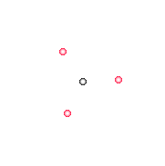
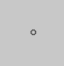
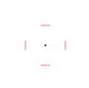

# Custom Cursor Overlay

This is a project written in rust to allow one to make custom cursor overlays. These cursors can read numbers like mouse position, mouse down, key states, etc. to acheive custom effects.

## Usage

1. Download from [here](https://github.com/ramonGonzEdu/customCursorOverlay/releases/latest).
2. Place `cursor.exe` where you want it.
3. Download a cursor from [the cursor directory](https://github.com/ramonGonzEdu/customCursorOverlay/tree/main/cursors), or make your own by using those as a template.
4. Either drag the `_____.jsonc` file onto `cursor.exe`, run `cursor.exe _____.jsonc` in a terminal.
   1. Alternatively, rename the file to `cursor.jsonc` and place it next to `cursor.exe` and just run cursor.exe.
5. To exit, alt+tab so that the cursor window is selected (you can't click on it as it's an overlay), and press `esc`.

## Making your own cursors

1. For now, just look at how the other cursors are made. I might write a guide later, though contributions are welcome.
2. There is also a schema.json file which can help with creating your own cursors.

## Example Cursors

Some example cursors will switch on and off when you press `Esc` and `B` in order to disable them in the buy menu. To disable this, just change the `buyMode` variable to `0.0`.

### Spinning Dots

This cursor has 3 red dots spinning around a black dot. The dots move in on left-click and out on right-click. The timings are matched to VALORANT knifes.

### My Cursor

This cursor recreates my valorant cursor. It consists of red bars and a red center dot which move out on left-click.

## Building

1. Install rust and cargo.
2. Clone the repo.
3. Run `cargo build --release` in the repo directory.
4. The executable will be in `target/release/cursor.exe`.
